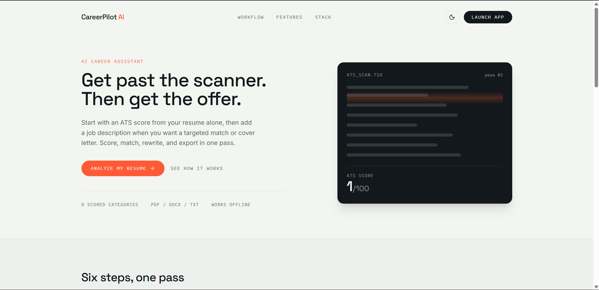
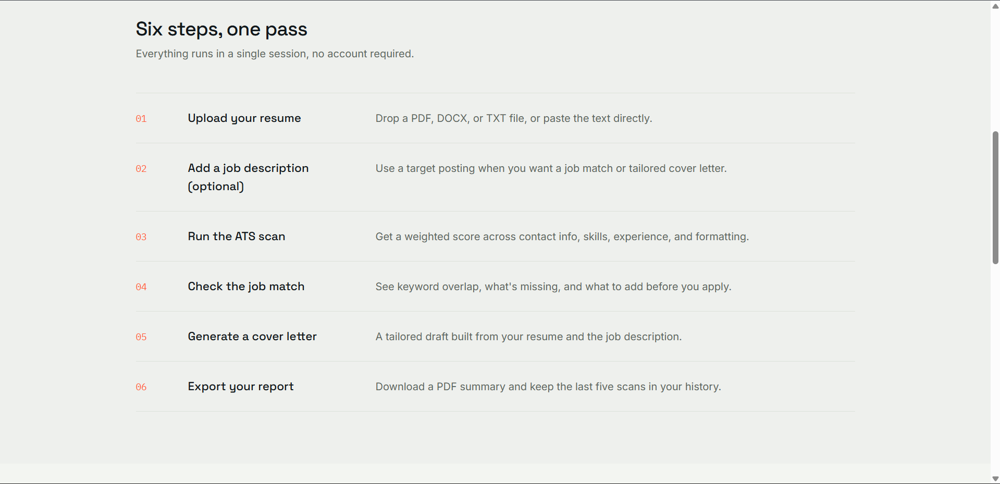
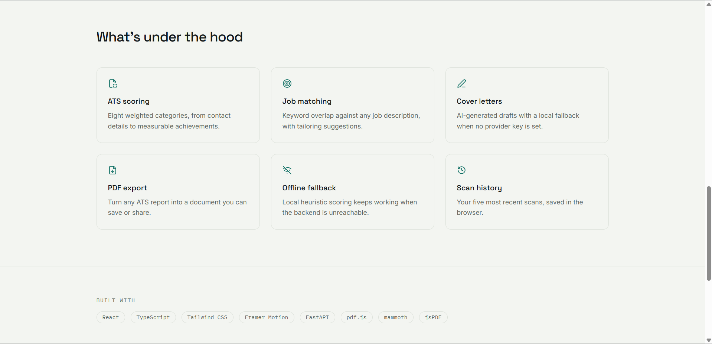
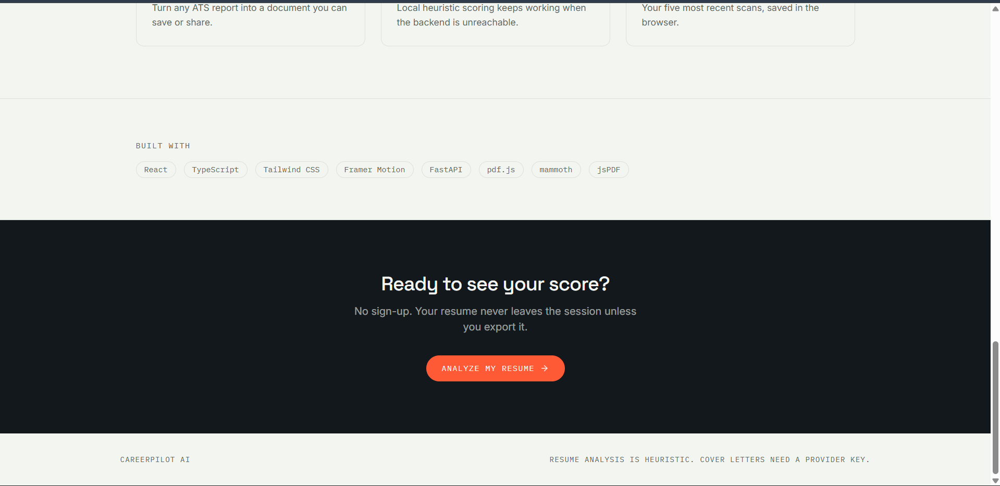

# CareerPilot AI

A full-stack resume analyzer and career assistant built for job seekers who want fast, actionable ATS feedback while keeping their workflow simple.

CareerPilot AI lets you upload or paste your resume, get an ATS-style score without a job description, and then add a target role to compare your resume, generate a tailored cover letter, and export a polished summary.

## Screenshots









## Features

- Resume-only ATS scoring with no job description required for the first pass.
- Upload PDF, DOCX, and TXT resumes with in-browser text extraction or paste resume text manually.
- Weighted ATS scoring across resume categories like contact info, summary, skills match, work experience, education, formatting, and measurable achievements.
- Optional job matching against any target job description with matched keywords, missing keywords, recruiter suggestions, and a match percentage.
- Tailored cover letter generation with provider fallback for local draft output.
- PDF export for ATS reports.
- Offline fallback support when the backend or provider is unavailable.
- Browser local storage history for the five most recent scans.
- Light and dark theme support.

## How it works

1. Open the app in your browser and launch the analyzer.
2. Upload a resume or paste your resume text.
3. Generate an ATS score to see a weighted breakdown and recommendations.
4. Add a target job description when you want a role-specific match or cover letter.
5. Run a job match to see keyword gaps and tailored suggestions.
6. Generate a cover letter and export your ATS report as PDF.

## Tech stack

- React 18 + TypeScript
- Vite
- Tailwind CSS
- Framer Motion
- FastAPI
- jsPDF
- mammoth
- pdf.js

## Local development

### Backend

```powershell
.\.venv\Scripts\python.exe -m uvicorn backend.app.main:app --host 127.0.0.1 --port 8000
```

### Frontend

```powershell
cd frontend
node .\node_modules\typescript\bin\tsc -b
node .\node_modules\vite\bin\vite.js --host 127.0.0.1 --port 5173
```

`npm run dev` is an alternative for the frontend development server.

Open the application at: [http://127.0.0.1:5173/](http://127.0.0.1:5173/)

### Test and build

Backend tests:

```powershell
.\.venv\Scripts\python.exe -m pytest backend\tests
```

Frontend build:

```powershell
cd frontend
node .\node_modules\typescript\bin\tsc -b
node .\node_modules\vite\bin\vite.js build
```

`npm run build` is an alternative for the frontend build.

Live demo: [https://md-nawaz17.github.io/CareerPilot-AI/](https://md-nawaz17.github.io/CareerPilot-AI/)
